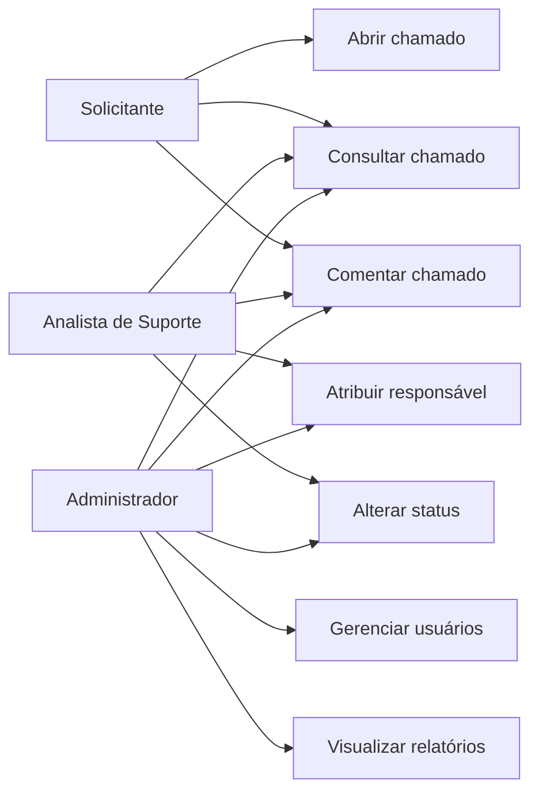
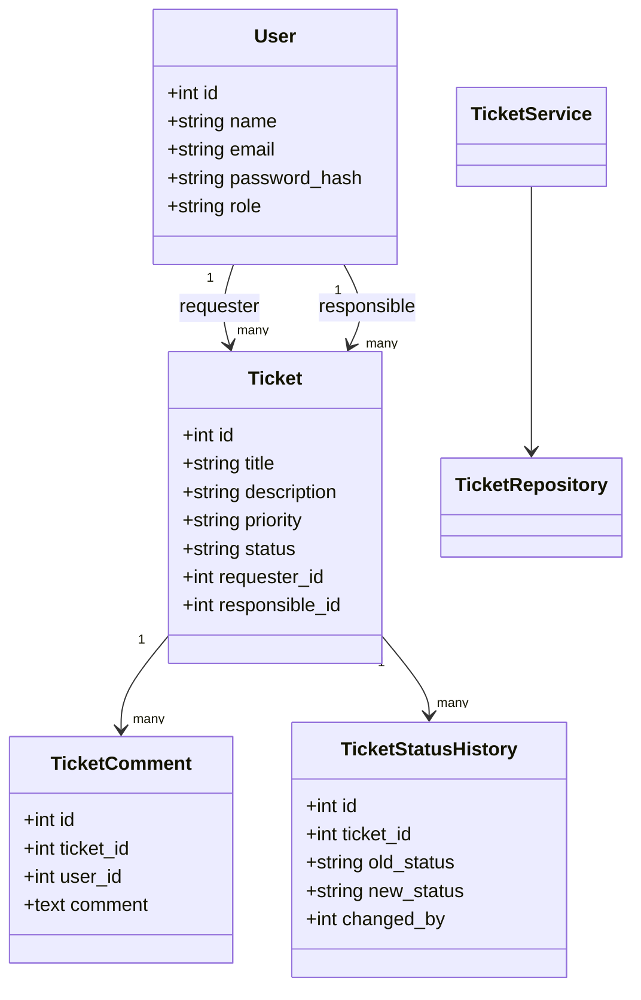
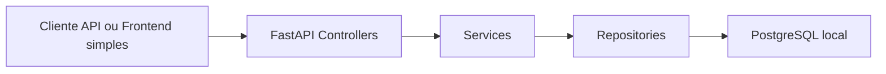
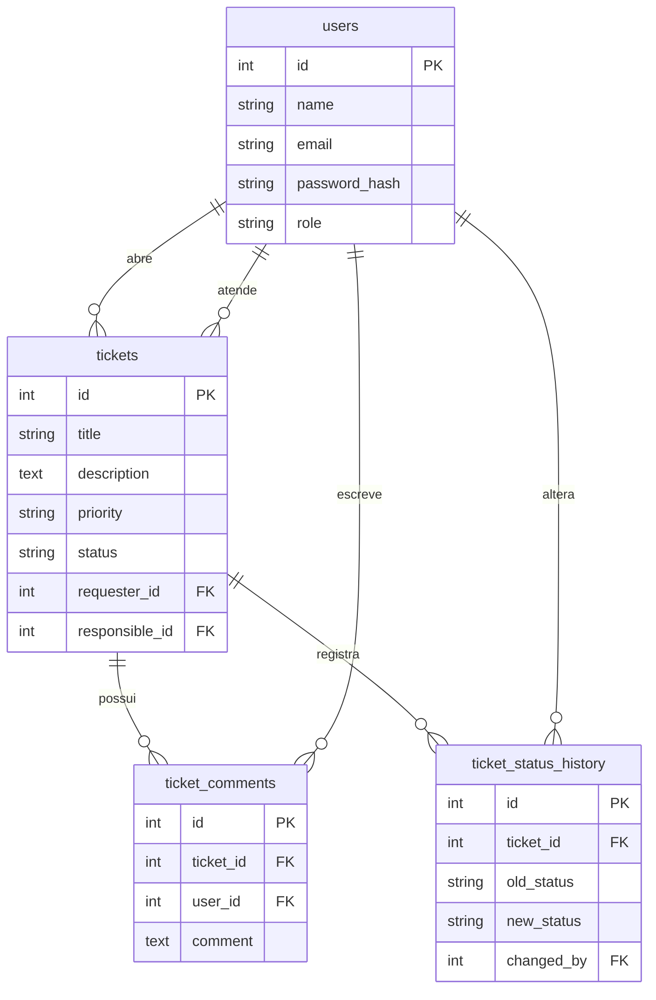

# Diagramas Mermaid

## Diagrama de Caso de Uso

```mermaid
flowchart LR
    Solicitante["Solicitante"] --> Abrir["Abrir chamado"]
    Solicitante --> Consultar["Consultar chamado"]
    Solicitante --> Comentar["Comentar chamado"]

    Analista["Analista de Suporte"] --> Consultar
    Analista --> Comentar
    Analista --> Atribuir["Atribuir responsável"]
    Analista --> Alterar["Alterar status"]

    Admin["Administrador"] --> Consultar
    Admin --> Comentar
    Admin --> Atribuir
    Admin --> Alterar
    Admin --> Gerenciar["Gerenciar usuários"]
    Admin --> Relatorios["Visualizar relatórios"]
```

## Diagrama de Classes

```mermaid
classDiagram
    class User {
        +int id
        +string name
        +string email
        +string password_hash
        +string role
    }

    class Ticket {
        +int id
        +string title
        +string description
        +string priority
        +string status
        +int requester_id
        +int responsible_id
    }

    class TicketComment {
        +int id
        +int ticket_id
        +int user_id
        +text comment
    }

    class TicketStatusHistory {
        +int id
        +int ticket_id
        +string old_status
        +string new_status
        +int changed_by
    }

    class TicketRepository
    class TicketService

    User "1" --> "many" Ticket : requester
    User "1" --> "many" Ticket : responsible
    Ticket "1" --> "many" TicketComment
    Ticket "1" --> "many" TicketStatusHistory
    TicketService --> TicketRepository
```

## Diagrama de Componentes

```mermaid
flowchart LR
    Cliente["Cliente API ou Frontend simples"] --> Controllers["FastAPI Controllers"]
    Controllers --> Services["Services"]
    Services --> Repositories["Repositories"]
    Repositories --> Database["PostgreSQL local"]
```

## Diagrama Entidade-Relacionamento

```mermaid
erDiagram
    users ||--o{ tickets : abre
    users ||--o{ tickets : atende
    tickets ||--o{ ticket_comments : possui
    users ||--o{ ticket_comments : escreve
    tickets ||--o{ ticket_status_history : registra
    users ||--o{ ticket_status_history : altera

    users {
        int id PK
        string name
        string email
        string password_hash
        string role
    }

    tickets {
        int id PK
        string title
        text description
        string priority
        string status
        int requester_id FK
        int responsible_id FK
    }

    ticket_comments {
        int id PK
        int ticket_id FK
        int user_id FK
        text comment
    }

    ticket_status_history {
        int id PK
        int ticket_id FK
        string old_status
        string new_status
        int changed_by FK
    }
```
