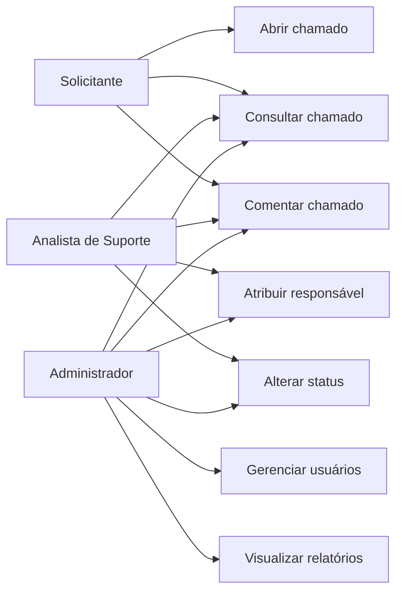
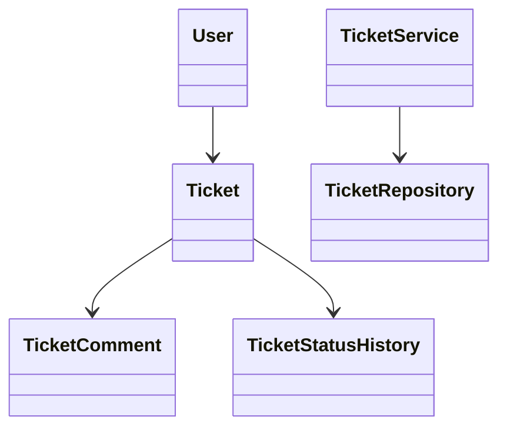
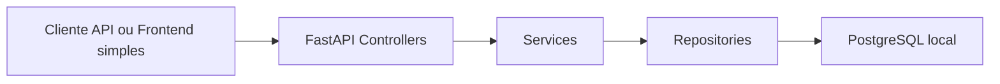
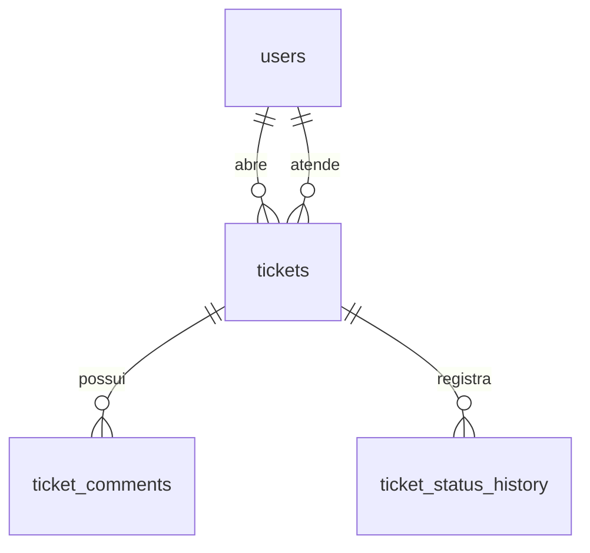

# Trabalho Final: Sistema de Chamados para Suporte Interno

## 1. Introdução do Projeto

O sistema proposto consiste em uma aplicação para abertura, acompanhamento e gerenciamento de chamados de suporte interno. A solução foi concebida para registrar solicitações de colaboradores, controlar prioridade, definir responsáveis, manter comentários e registrar o histórico de evolução de cada atendimento.

A motivação do projeto está relacionada à necessidade de organizar demandas internas de suporte em empresas que ainda utilizam processos informais, como e-mail, mensagens instantâneas ou anotações manuais. Nesse contexto, o sistema contribui para rastreabilidade, visibilidade operacional e melhor comunicação entre solicitantes e equipe técnica.

O escopo do projeto contempla um MVP com API REST, persistência em PostgreSQL local, migrations, testes automatizados e documentação técnica e acadêmica. O público-alvo é formado por colaboradores internos, analistas de suporte e administradores.

## 2. Escolha e Justificativa do Processo de Software

O processo de software escolhido foi o SCRUM. A escolha se justifica por sua capacidade de organizar o desenvolvimento em entregas incrementais, favorecer adaptação a mudanças, estruturar o trabalho em sprints e apoiar a construção de um MVP funcional.

### Product Backlog

- Cadastro de usuários.
- Abertura de chamados.
- Atribuição de responsáveis.
- Alteração de status.
- Registro de comentários.
- Histórico de status.
- Relatórios simples.
- Documentação e testes.

### Sprint Backlog

- Sprint 1: modelagem do problema, requisitos e arquitetura.
- Sprint 2: implementação do backend e persistência.
- Sprint 3: testes, documentação e refinamento final.

### Sprints sugeridas

- Sprint 1: levantamento de requisitos e modelagem de domínio.
- Sprint 2: implementação das entidades, repositórios, serviços e controllers.
- Sprint 3: migrations, testes automatizados, seed e relatórios.
- Sprint 4: documentação acadêmica, revisão e apresentação.

### Papéis do SCRUM adaptados ao trabalho acadêmico

- Product Owner: representa a visão do trabalho e define prioridades de entrega.
- Scrum Master: organiza o fluxo, remove impedimentos e acompanha a execução.
- Time de Desenvolvimento: implementa, testa e documenta a solução.

Em um contexto acadêmico, esses papéis podem ser acumulados por um único estudante ou distribuídos entre integrantes da equipe.

## 3. Levantamento e Análise de Requisitos

A técnica utilizada para levantamento foi brainstorming aliado à análise das necessidades internas de suporte, considerando o fluxo de abertura, acompanhamento e encerramento de chamados.

### Requisitos Funcionais

- RF01 - O sistema deve permitir cadastrar usuários.
- RF02 - O sistema deve permitir abrir chamados.
- RF03 - O sistema deve permitir definir prioridade do chamado.
- RF04 - O sistema deve permitir atribuir responsável.
- RF05 - O sistema deve permitir alterar status do chamado.
- RF06 - O sistema deve permitir comentar em chamados.
- RF07 - O sistema deve permitir consultar histórico do chamado.
- RF08 - O sistema deve permitir filtrar chamados por status, prioridade e responsável.
- RF09 - O sistema deve permitir listar chamados por solicitante.
- RF10 - O sistema deve permitir gerar relatórios simples.

### Requisitos Não Funcionais

- RNF01 - O sistema deve utilizar PostgreSQL.
- RNF02 - O sistema deve possuir API REST.
- RNF03 - O sistema deve seguir Clean Code.
- RNF04 - O sistema deve ter testes automatizados.
- RNF05 - O sistema deve ser executável localmente, sem Docker.
- RNF06 - O sistema deve possuir documentação de instalação e uso.
- RNF07 - O sistema deve usar variáveis de ambiente para configuração.
- RNF08 - O sistema deve seguir princípios SOLID quando aplicável.

### Histórias de Usuário

- Como colaborador, quero abrir um chamado para solicitar suporte interno.
- Como analista de suporte, quero visualizar chamados atribuídos a mim.
- Como administrador, quero acompanhar todos os chamados da empresa.
- Como usuário, quero comentar em um chamado para complementar informações.
- Como suporte, quero alterar o status do chamado para manter o solicitante informado.
- Como administrador, quero visualizar relatórios simples por status, prioridade e responsável.

## 4. Projeto de Software

### Arquitetura em camadas

O sistema foi estruturado em camadas compostas por controllers, services, repositories, models e schemas. Essa organização favorece separação de responsabilidades, reuso de código e manutenção evolutiva.

### Tecnologias escolhidas

- FastAPI para criação da API REST.
- SQLAlchemy como ORM.
- PostgreSQL como banco relacional.
- Alembic para versionamento de schema.
- Pydantic para validação.
- Pytest para testes automatizados.

### Justificativa das tecnologias

As tecnologias escolhidas oferecem produtividade, clareza de código, boa integração entre si e aderência ao objetivo de desenvolver um sistema acadêmico com estrutura profissional.

### Modelagem do banco de dados

O modelo contempla as entidades `users`, `tickets`, `ticket_comments` e `ticket_status_history`, permitindo rastrear todo o ciclo de vida dos chamados.

### Protótipos textuais das telas

- Tela 1: cadastro de usuário com nome, e-mail, senha e papel.
- Tela 2: abertura de chamado com título, descrição e prioridade.
- Tela 3: listagem de tickets com filtros.
- Tela 4: detalhes do ticket com comentários e histórico.
- Tela 5: visão administrativa com relatórios simples.

### Diagrama de Caso de Uso



### Diagrama de Classes



### Diagrama de Componentes



### Diagrama Entidade-Relacionamento



## 5. Implementação

O MVP implementado contempla cadastro de usuários, abertura de chamados, listagem com filtros, atribuição de responsável, alteração de status, comentários, histórico de status e relatórios simples. A API foi construída com FastAPI e utiliza SQLAlchemy para persistência no PostgreSQL.

Trecho representativo da regra de negócio de mudança de status:

```python
def update_ticket_status(self, ticket_id: int, new_status: TicketStatus, changed_by: int) -> Ticket:
    ticket = self.get_ticket(ticket_id)
    old_status = ticket.status
    ticket.status = new_status
    updated_ticket = self.ticket_repository.update(ticket)
    self.ticket_repository.add_status_history(
        TicketStatusHistory(
            ticket_id=ticket.id,
            old_status=old_status,
            new_status=new_status,
            changed_by=changed_by,
        )
    )
    return updated_ticket
```

## 6. Testes

Os testes automatizados foram desenvolvidos com Pytest, cobrindo cenários essenciais do sistema.

- Criar usuário com sucesso.
- Criar ticket com sucesso.
- Impedir criação de ticket sem título.
- Alterar status de ticket.
- Registrar histórico ao alterar status.
- Adicionar comentário em ticket aberto.
- Impedir comentário em ticket fechado.
- Filtrar tickets por prioridade.
- Filtrar tickets por responsável.

## 7. Conclusão

O projeto atingiu o objetivo de entregar um sistema funcional e organizado para gestão de chamados de suporte interno. Entre os resultados alcançados destacam-se a construção de uma API REST em arquitetura em camadas, a modelagem consistente do banco de dados, a implementação de regras de negócio relevantes e a produção de documentação acadêmica compatível com um trabalho final.

Entre os desafios enfrentados estão a separação adequada de responsabilidades, a definição de uma modelagem simples, porém suficiente para o MVP, e a garantia de rastreabilidade das mudanças de status. Como aprendizado, o trabalho reforça a importância de requisitos claros, planejamento incremental, testes automatizados e boas práticas de Engenharia de Software.

Como evolução futura, recomenda-se implementar autenticação, anexos, notificações automáticas, SLA e um frontend completo para melhorar a experiência de uso.
